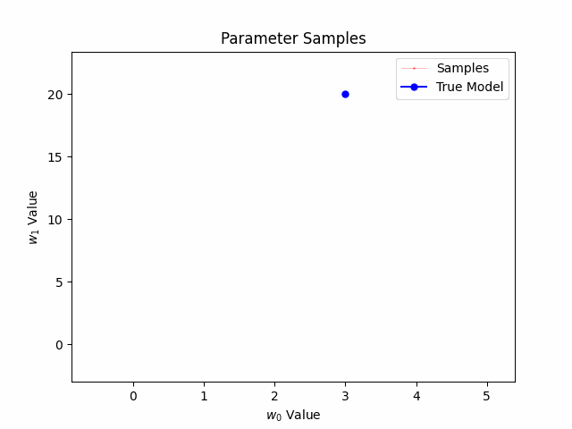

# Bayesian Linear Regression with Metropolis Hastings
Python implementation of a Bayesian Linear Regression model using Metropolis Hastings algorithm to approxiamte the posterior distribution on the model's parameters. 

